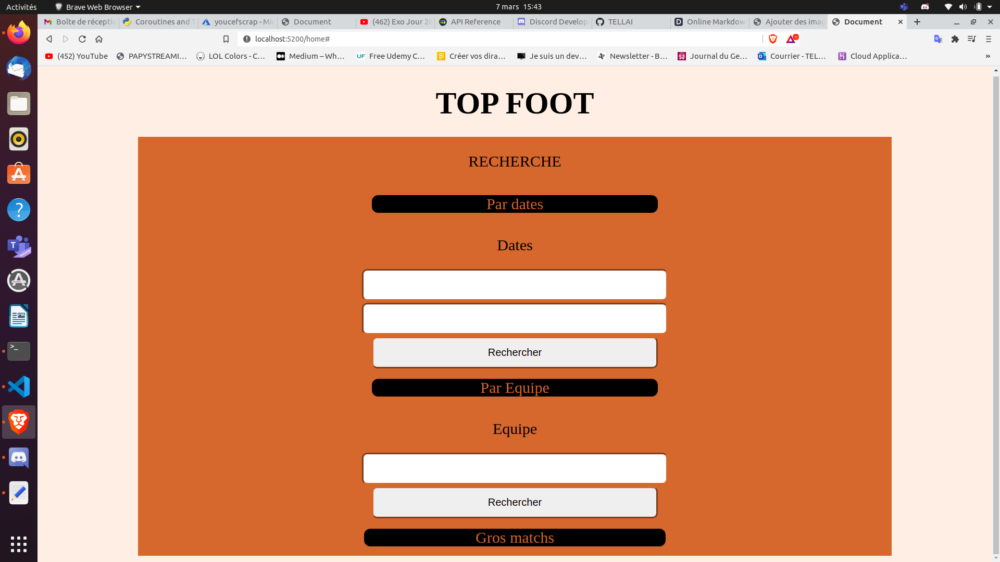
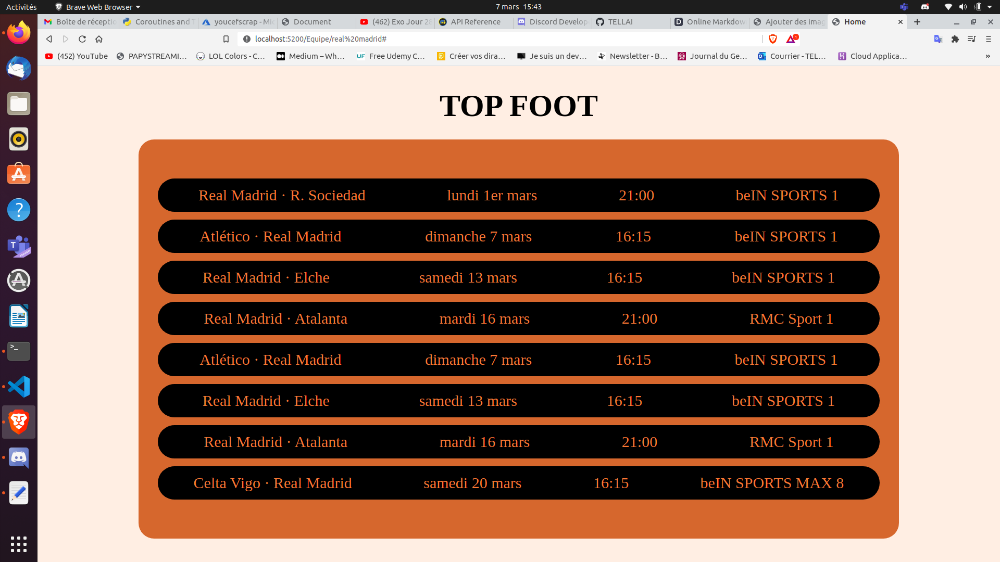

# Scrapper

## Le code au service de la passion !!!

Ce dépôt contient le frontend et le backend de l'application scrapper_foot qui permet de récuperer des informations sur la programmation des matchs de foot à venir.

## Features

- Faire une recherche pour obtenir le calendrier de votre équipe favorite
- Faire une recherche pour une date donnée
- Avoir la liste des meilleurs matchs (entre grandes équipes).

## Tech

Cette application utilise les technologies suivantes:

### Front-end:

- [HTML] - Pour la mise en page
- [CSS] - Pour le style
- [JINJA] - Pour la liaison Front et Back

### Back-end:

- [Python] - Pour l'algorythme
- [Flask] - Pour communiquer avec ma base de donnée
- [Mysql] - Stockage des données

### Autres:

- [Docker] - Pour conteneuriser mon application

## Installation

1- Cloner ce repository en local
2- Executer cette commande pour ouvrir le project sur un conteneur docker:
====> sudo docker build -t (nom_image) .
====> sudo docker run -it --rm (nom_image) -p 5200:(port_conteneur)

## Developement

1- Pour améliorer le rendement de mon application je doit trouver une meilleur d'information à scrapper
2- Déployer cette application sur le Cloud afin de l'utiliser au quotidien

## Templete

